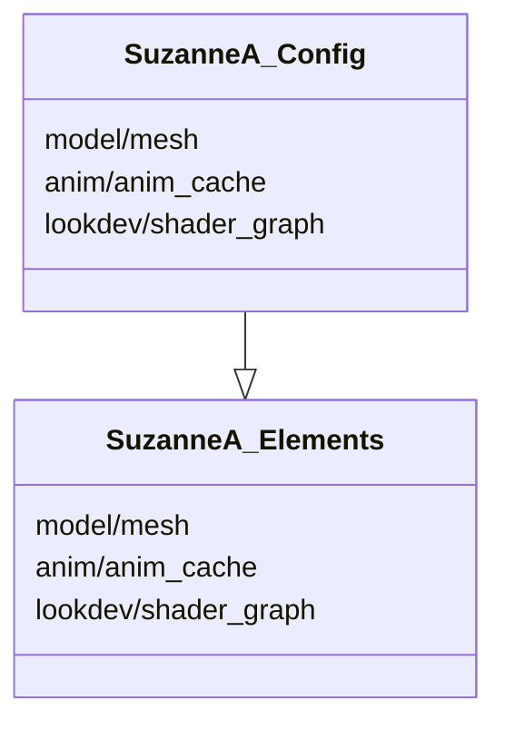
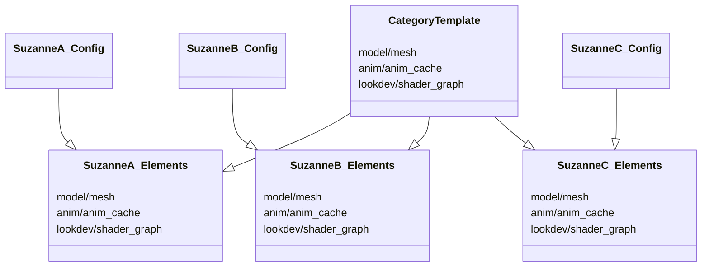
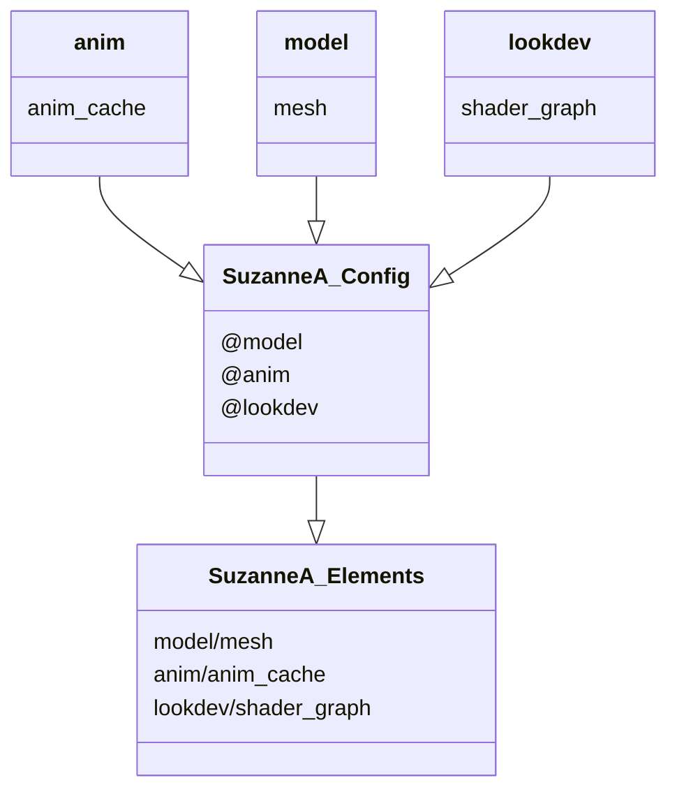
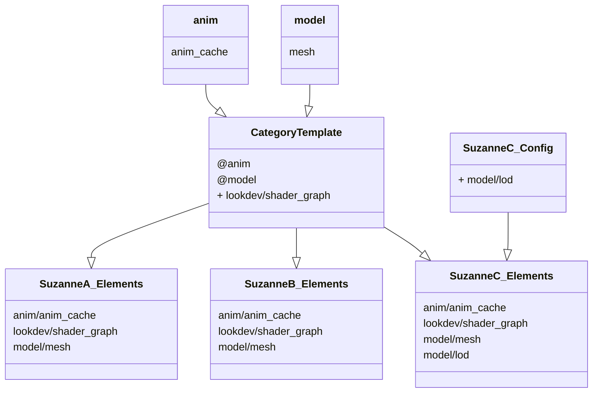

# Anatomy of an Asset

{: .no_toc }

## Table of contents
{: .no_toc .text-delta }

1. TOC
{:toc}

---


## Important Considerations

### Asset Interactivity
Assets need to be able to be aware of other assets as some assets may be dependent upon others.

### Asset Elements / Load Order
Assets are typically made up of many elements, often created by different departments. It is important to avoid unnecessary feedback loops within the asset structure, minimizing occurences where completion of work in one department requires another department to do additional work in order for the asset to be picked up down the line.

In order to achieve this, we can configure a specific load order in which elements are brought in to a scene. This allows elements to access other elements in a deterministic way, where each element acts as a layer on top of previous elements.

## Element Configuration
An assets elements can be configured in multiple places. This is to allow assets to inherit a default set of elements based on the context they exist in.

### Per-Asset Elements
The most basic type of configuration is to specify all elements of an element inside the asset's configuration, like so:

```yaml
assets:
  3d:
    character:
    - suzanneA: 
        departments:
          model:
            - mesh
          anim:
            - anim_cache
          lookdev:
            - shader_graph
```

This configuration clearly shows which departments are contributing which elements to the asset, and is easy to understand at a glance.



However, in practice many assets will end up sharing a similar structure, and having to explicitly specify every element for every asset will quickly end up with a significant amount of extra configuration. To avoid this, an asset can also inherit elements based on their category, as well as departments

### Category Template Asset

If you are certain that all assets of the same category will have a similar structure, you can specify a template asset in the configuration which all other elements in the same category will inherit from

```yaml
assets:
  3d:
    character:
    - $template: # Note the keyword `$template`
        departments:
          anim:
            - anim_cache
          lookdev:
            - shader_graph
          model:
            - mesh
    - suzanneA: {}
    - suzanneB: {}
    - suzanneC: {}
```

In this example, we have 3 `suzanne` asset variants, `A`, `B`, and `C`. Although each of these assets do not explicitly specify their departments or elements, all of them have `anim`, `lookdev`, and `model` departments, and the associated elements, as they are inherited from the category `3d/character`'s template.





### Department Default Elements

If there are certain elements that a given department may *always* contribute to a given asset, it may make more sense to use department defaults. 


```yaml
departments:
  anim:
    default_elements:
    - anim_cache
  lookdev:
    default_elements:
    - shader_graph
  model:
    default_elements:
    - mesh

assets:
  3d:
    character:
    - suzanneA: {}
        departments:
          model: []
          lookdev: []
          anim: []
```

In this example, default elements are specified as part of the department configuration. This allows any element which this department contributes to, to inherit these elements.



### Combining Inheritance

It is also worth noting, that these methods of inheritance can be combined, meaning you can specify a default set of elements on a per-department basis, and then also specify a default set of departments which contribute to an asset on a category asset template

```yaml
departments:
  anim:
    default_elements:
    - anim_cache
  lookdev: {}
  model:
    default_elements:
    - mesh

assets:
  3d:
    character:
    - $template:
        departments:
          anim: []
          lookdev:
            - shader_graph
          model: []
    - suzanneA: {}
    - suzanneB: {}
    - suzanneC: 
        departments:
          model:
            - lod
```

Here, all 3 `suzanne` assets will be contributed to by the departments specified in the template, and each of these departments will contribute their default set of elements.

We can also still specify changes to both, individial elements, or the template in order to insert additional elements on top of the defaults. Note that `suzanneC` is also specifying an additional `lod` element from the `model` department

